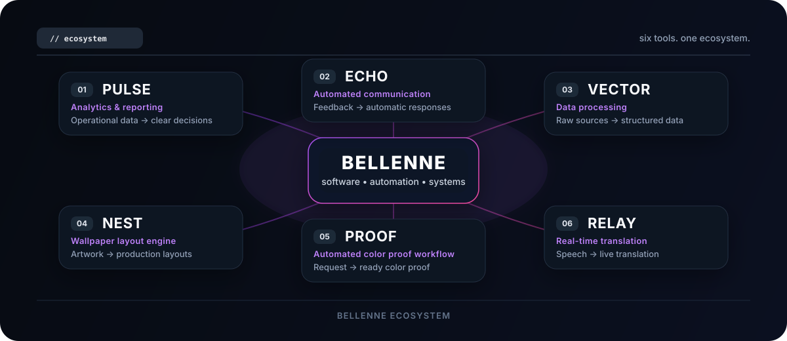

 

  

**I build software for automation, production workflows, analytics and internal tools.**

My projects are focused on one idea:

> make complicated everyday workflows simple, observable and automatic.

---

  

---

## `// stack`

---

### `build → automate → improve → repeat`

Bellenne / software made to remove unnecessary work.

  

